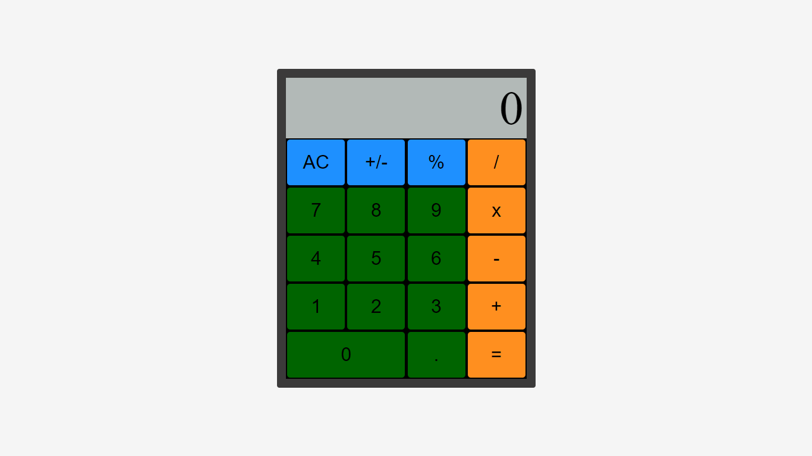

## Basic-Calculator
This calculator contains functions for all of the basic math operators you typically find on simple calculators.
## Technology Stack
1. HTML5
2. CSS3
3. Javascript ES6
## Usage
1. Clone project repository. Here's the repository link. `git clone https://github.com/MopholosiCodes/MopholosiCodes.github.io.git`
2. Run in VS Code using live server.
## Contribution
Your contributions are welcome. Here's my suggested workflow:
1. Fork the project.
2. Make your feature addition or bug fix.
3. Send us a pull request with a description of your work.
## Demo

